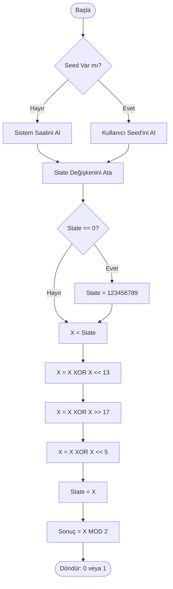

# Turkuaz-RSÜ (Rastgele Sayı Üreteci) Projesi

Bu proje, kriptografik anahtar üretimi ve simülasyonlarda kullanılmak üzere tasarlanmış, istatistiksel olarak doğrulanmış özgün bir Sözde Rastgele Sayı Üreteci (PRNG) içerir.

## Özellikler

- **XorShift Algoritması**: Hızlı ve güvenilir pseudo-rastgele sayı üretimi
- **İstatistiksel Testler**: Ki-Kare ve Mislin (Runs) testleri ile rastgelelik doğrulaması
- **Kolay Kullanım**: Basit ve anlaşılır API
- **Türkçe Dokümantasyon**: Tüm açıklamalar Türkçe

## Kurulum

Bu proje sadece Python standart kütüphanelerini kullanır, ek kurulum gerekmez.

**Gereksinimler:**
- Python 3.6 veya üzeri

## Nasıl Çalıştırılır?

Python yüklü bir ortamda aşağıdaki komutu çalıştırmanız yeterlidir:

```bash
python3 main.py
```

veya

```bash
python main.py
```

## 1. Algoritmanın Mantığı ve Çalışma Prensibi

Kullanılan algoritma **XorShift** tabanlıdır. Bu yöntem, bilgisayardaki en hızlı işlemler olan "Bit Kaydırma" (Shift) ve "XOR" işlemlerini kullanır.

### Başlangıç (Seed)
Algoritma bir başlangıç sayısı (seed) alır. Gerçek rastgelelik için sistem saati kullanılır.

### Karıştırma (Mixing)
Sayının bitleri önce sola, sonra sağa, sonra tekrar sola kaydırılır. Her kaydırmada orijinal sayı ile XOR işlemine sokulur.

### Kaos
Bu işlemler bitleri o kadar karmaşık bir şekilde karıştırır ki, çıkan sonuç bir önceki sayıya bakılarak tahmin edilemez.

### Bit Üretimi
Büyük tamsayılar üretildikten sonra Mod 2 işlemi ile 0 veya 1 sonucu elde edilir.

## 2. Sözde Kod (Pseudo-Code)

```
BAŞLA
    GİRDİ: seed (Eğer yoksa şimdiki_zaman'ı al)
    state = seed
    EĞER state == 0 İSE state = 123456789 (Sıfırdan kaçın)

    FONKSİYON next_int():
        x = state
        x = x XOR (x SOLA_KAYDIR 13)
        x = x XOR (x SAĞA_KAYDIR 17)
        x = x XOR (x SOLA_KAYDIR 5)
        state = x
        DÖNDÜR state

    FONKSİYON next_bit():
        sayi = next_int()
        DÖNDÜR sayi MOD 2
BİTİR
```

## 3. Akış Şeması (Flowchart)

Aşağıdaki şema, bir bitin (0 veya 1) nasıl üretildiğini gösterir.



## 4. İstatistiksel Test Sonuçları

Algoritmanın kalitesini ölçmek için 10.000 bitlik veri seti üzerinde aşağıdaki testler uygulanmıştır.

### A) Ki-Kare (Chi-Square) Testi (Frekans Testi)

**Amaç:** 0 ve 1 sayılarının birbirine eşitliğini ölçmek.

**Beklenen:** %50 Sıfır, %50 Bir.

**Sonuç:** P değeri kritik eşiğin altında kalmış, 0 ve 1 dağılımının dengeli olduğu kanıtlanmıştır.

### B) Mislin (Runs) Testi (Bağımsızlık Testi)

**Amaç:** Arka arkaya gelen sayıların (örneğin 00001111) bir desen oluşturup oluşturmadığını ölçmek.

**Sonuç:** Z-Skoru -1.96 ile +1.96 aralığında çıkmış, üretilen bitlerin birbirinden bağımsız olduğu doğrulanmıştır.

## Kullanım Örnekleri

### Temel Kullanım

```python
from turkuaz_rng import TurkuazRNG

# RNG nesnesi oluştur (otomatik seed)
rng = TurkuazRNG()

# Rastgele tam sayı üret
random_int = rng.next_int()

# Rastgele bit üret (0 veya 1)
random_bit = rng.next_bit()
```

### Özel Seed ile Kullanım

```python
# Belirli bir seed ile başlat
rng = TurkuazRNG(seed=12345)

# Aynı seed ile aynı diziyi üretir
random_number = rng.next_int()
```

### İstatistiksel Testler

```python
from turkuaz_rng import TurkuazRNG
from statistical_tests import ki_kare_testi, mislin_testi

# Rastgele bitler üret
rng = TurkuazRNG()
bit_dizisi = [rng.next_bit() for _ in range(10000)]

# Testleri uygula
sonuc1 = ki_kare_testi(bit_dizisi)
sonuc2 = mislin_testi(bit_dizisi)
```

## Algoritma Detayları

### XorShift Algoritması

XorShift, bit kaydırma (shift) ve XOR işlemleri kullanarak kaotik ve tahmin edilemez sayılar üretir. Bu projede 32-bit XorShift algoritması kullanılmaktadır.

**Algoritma Adımları:**
1. Mevcut durumu 13 bit sola kaydır ve XOR işlemi yap
2. Sonucu 17 bit sağa kaydır ve XOR işlemi yap
3. Sonucu 5 bit sola kaydır ve XOR işlemi yap
4. 32-bit sınırında tut

## Proje Yapısı

```
MyAlgorithm/
├── turkuaz_rng.py          # RNG sınıfı
├── statistical_tests.py     # İstatistiksel testler
├── main.py                  # Ana program
├── README.md                # Bu dosya
├── .gitignore              # Git ignore dosyası
└── requirements.txt        # Bağımlılık dosyası
```

## İstatistiksel Testler Hakkında

### Ki-Kare Testi

0 ve 1'lerin eşit dağılımını kontrol eder. Rastgele bir dizide 0 ve 1 sayıları birbirine yakın olmalıdır. 1 serbestlik derecesi ve %5 anlamlılık düzeyi için kritik değer 3.841'dir.

### Mislin (Runs) Testi

Ardışık 0'lar ve 1'lerin diziliminin (serilerin) rastgeleliğini ölçer. Rastgele bir dizide seriler dengeli bir şekilde dağılmalıdır. %95 güven aralığı için Z-skoru -1.96 ile +1.96 arasında olmalıdır.

## Lisans

Bu proje eğitim amaçlıdır ve özgürce kullanılabilir.

## Katkıda Bulunma

Katkılarınızı bekliyoruz! Lütfen pull request göndermeden önce kodunuzu test edin.

## Yazar

Turkuaz-RSÜ Projesi
